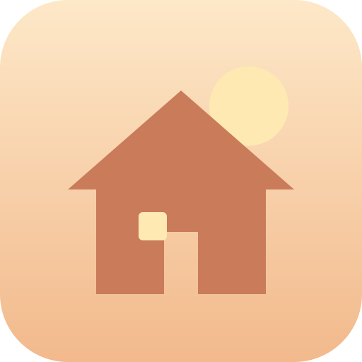

# Comfy home

Web app (PWA) per **Windows 11** e **Android** che invia comandi cifrati a dispositivi
**ESP8266 / ESP32** sulla rete WiFi (o via 4G/5G quando i device sono raggiungibili
da remoto) e resta **in ascolto continuo** delle loro trasmissioni.



## Caratteristiche

- **Tema caldo e sereno**, leggibile e non affollato; testo selezionabile.
- **Dispositivi**: ogni ESP è configurato con nome, `IP:porta`, chiave di cifratura
  personale e timeout di conferma (in secondi, diverso per ogni device).
- **Comandi**: composti da più parametri aggiunti con *"+ Inserisci parametro"*,
  concatenati con `|` e terminati da `$` (es. `accendi|luce|salotto$`). A ogni comando
  si associano il device target e un'**icona scelta dalla gallery**.
- **Send** cifra la stringa e la invia; il device risponde con `[nome_device]_[stringa ricevuta]`:
  - conferma coincidente → **✓ verde** accanto al nome del device;
  - conferma diversa o **timeout** → **✗ rossa**.
- **Ascolto continuo**: la connessione WebSocket resta aperta; ogni trasmissione
  spontanea del device viene decifrata e registrata. Solo i messaggi che iniziano
  con `[nome_device]_` sono trattati come conferme: la telemetria spontanea che
  arriva durante l'attesa non altera l'esito del comando (quindi le trasmissioni
  spontanee del firmware **non** devono usare quel prefisso).
- **Log per device**: data e ora di tutte le stringhe inviate e ricevute, in qualunque momento.
- **PWA**: installabile, con cache offline dell'interfaccia.

## Architettura

```
Browser (PWA)  ── ws://IP:porta ──►  ESP8266 / ESP32 (server WebSocket)
     ▲                                        │
     └───────── conferma cifrata ◄────────────┘
```

- **Trasporto**: WebSocket (`ws://IP:porta/`). È l'unico canale che permette a una
  web app di *ricevere* trasmissioni spontanee dai device in ogni momento.
- **Cifratura**: **AES-256-GCM** (autenticata: qualunque manomissione viene rifiutata).
  - Chiave: `SHA-256(passphrase del device)` — ogni device ha la sua.
  - Formato messaggio: `base64( IV[12] ∥ ciphertext ∥ tag[16] )`, IV casuale per ogni messaggio.
  - Nel browser: WebCrypto quando disponibile; altrimenti implementazione JS integrata,
    **auto-testata all'avvio con vettori NIST** (se l'auto-test fallisse l'invio si disabilita).
  - Sugli ESP: libreria open source [rweather/Crypto](https://github.com/rweather/arduinolibs)
    (`AES256` + `GCM`), disponibile per ESP8266 ed ESP32.

## Avvio

L'app è statica: basta servire la cartella `comfy-home/` con un qualunque server HTTP.

```bash
cd comfy-home
python3 -m http.server 8080
# oppure: npx serve, nginx, ecc.
```

- **Windows 11**: aprire `http://localhost:8080` (o l'IP del PC che la serve) in
  Edge/Chrome → menu **App → Installa Comfy home**.
- **Android**: aprire lo stesso URL in Chrome → menu ⋮ → **Aggiungi a schermata Home**.

> **Nota (mixed content):** i browser bloccano le connessioni `ws://` avviate da pagine
> `https://`. Servire quindi l'app in `http://` sulla rete locale (o da `localhost`),
> non da un hosting HTTPS.

## Uso via 4G/5G

L'app usa la rete disponibile sul dispositivo: se lo smartphone è in 4G/5G i device
devono essere raggiungibili dall'esterno. La soluzione **raccomandata** è una VPN
verso la rete di casa (es. WireGuard sul router): i device restano non esposti e
l'app funziona senza alcuna modifica, usando gli stessi `IP:porta` interni.
Esporre le porte degli ESP direttamente su Internet è sconsigliato.

## Sicurezza — decisioni e limiti

- **Integrità e riservatezza**: AES-256-GCM autentica ogni messaggio; chi non conosce
  la chiave non può né leggere né forgiare comandi.
- **XSS**: nessun dato dinamico entra nel DOM come HTML (solo `textContent`); le icone
  della gallery vengono **ri-rasterizzate su canvas** (qualunque payload attivo, es.
  SVG con script, viene eliminato) e validate come `data:image/png|jpeg` al caricamento.
- **Input**: nome device, host/IP, porta, chiave, timeout e parametri sono validati
  sia nel form sia in rilettura dallo storage (difesa da storage corrotto).
  I caratteri di protocollo `|` e `$` sono vietati nei parametri, `_` nel nome device.
  Nomi e coppie indirizzo:porta duplicati vengono rifiutati (renderebbero ambigue
  le conferme).
- **Limiti noti** (da valutare rispetto al proprio modello di minaccia):
  - le chiavi sono salvate in `localStorage` del profilo browser: chi ha accesso
    fisico e sbloccato al dispositivo può leggerle;
  - GCM non previene il **replay** di un messaggio catturato, e una conferma arrivata
    in ritardo (dopo il timeout) potrebbe combaciare con un re-invio successivo dello
    stesso comando: se rilevante per il proprio modello di minaccia, includere un
    contatore/timestamp nei parametri del comando e verificarlo sull'ESP;
  - una web app non può restare in ascolto **ad app chiusa** (limite della piattaforma):
    l'ascolto è attivo finché l'app è aperta, anche in background recente.

## Test

Il progetto è stato verificato con:

- vettori **NIST SP 800-38D** (GCM) e **FIPS-197** (AES) per il modulo crittografico;
- test di interoperabilità bidirezionale tra il backend JS puro e WebCrypto;
- suite **end-to-end** in Chromium (Playwright) contro finti device ESP WebSocket:
  configurazione, icone dalla gallery, composizione comandi, invio con conferma ✓,
  timeout ✗, conferma errata ✗, trasmissioni spontanee, log, persistenza, validazioni.

## Struttura

```
comfy-home/
├── index.html            shell dell'app
├── css/style.css         tema
├── js/
│   ├── main.js           router + viste
│   ├── ui.js             helper DOM sicuri, toast, indicatori
│   ├── crypto.js         AES-256-GCM (WebCrypto + fallback JS auto-testato)
│   ├── storage.js        persistenza, validazione, icone
│   └── connection.js     WebSocket, riconnessione, conferme/timeout
├── sw.js                 service worker (offline)
├── manifest.webmanifest  manifest PWA
└── icons/                icone app
```

Il firmware per gli ESP (ricezione, decifratura, conferma) è previsto come fase
successiva del progetto.
